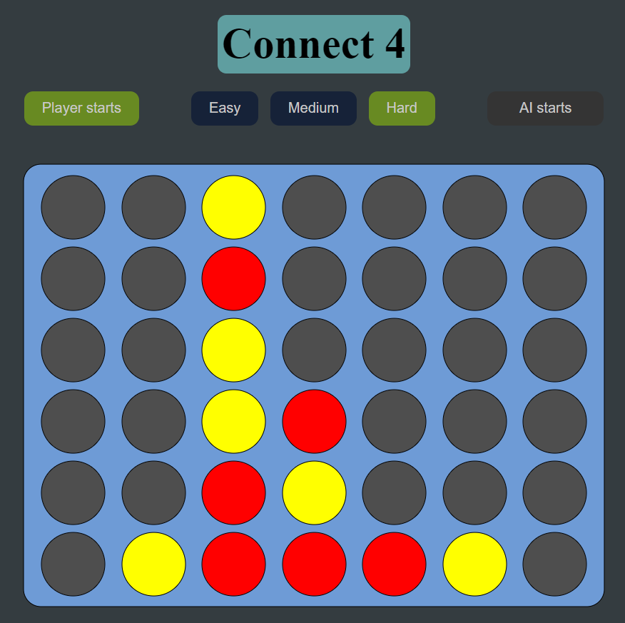
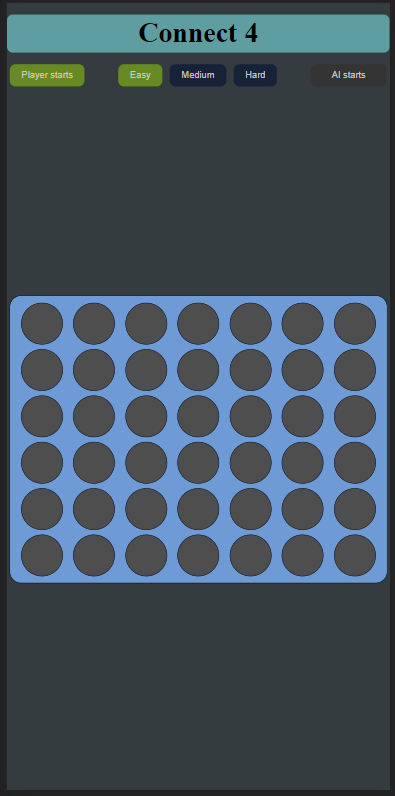

# Connect 4

<b>
Click <a href="../projects/games/connect4/c4.html" class="hlink">here</a> to play the game in your browser!   Available on both desktop and mobile!
</b>
   

  

    This program will play connect 4 with you. You may choose between 3 difficulty modes and also
    determine if you or the AI should start first.

 

    I made this program mainly to practice implementing the minimax algorithm. Although writing the code
    for the minimax algorithm was simple enough, the main issue I faced was that my program kept
    freezing and crashing which rendered testing and debugging hopeless. After hours of
    racking my brain for possible problems, a quick google search showed that there were
    4,531,985,219,092
    possibilities in this game which quickly made me realise that I was probably having memory issues
    due to the huge number of recursive function calls. This issue was ultimately resolved with a
    combination of alpha beta pruning and also restricting the max-depth of searches. This program took
    me way longer than needed to make but I have no regrets spending so much time on this program as I
    genuinely felt as though I've learnt a lot through this experience.

 

Here a few screenshots of the program

 

 

    This is what the gameplay looks like. The user may choose his desired difficulty level which is
    done by changing the depth of the minimax recursive function calls and also the starting player.

 

 

This is a screenshot of the program on a mobile device.

 
